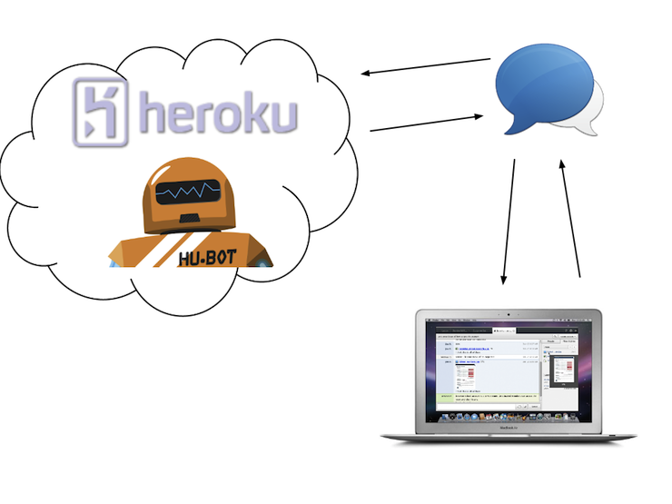

!SLIDE

# Hubot @ baltimore.js
## [http://j.mp/hubot](http://j.mp/hubot)
## [http://hubot-bjs.heroku.com/](http://hubot-bjs.heroku.com/)

!SLIDE bullets full-page
# Haiiiii!
## i'm [@kylefritz](http://twitter.com/kylefritz)
## go here: [http://j.mp/hubot](http://j.mp/hubot)

!SLIDE fullscreen middle

!SLIDE bullets
#You'll need

 * [node.js](http://nodejs.org/)
 * [heroku toolbelt](https://toolbelt.heroku.com/)
 * [hubot template](https://github.com/github/hubot/downloads)
 * OMG this is easy now

!SLIDE
# Try it locally

    $ cd your-robot 
    $ npm install
	# will spit & curse
    $ bin/hubot
	# more spitting & cursing
	# press enter!
	Hubot> hubot image me kittens

!SLIDE
#push it to heroku
  * [choose an adapter](https://github.com/github/hubot/wiki)
  * turn your template into a git repo
  * create *cedar stack* heroku app
  * push hubot & configure variables with `heroku config:add SETTING=value`

!SLIDE
#for deploy details
 * check the [wiki](https://github.com/github/hubot/wiki/Deploying-Hubot-onto-Heroku)
 * if you have the heroku toolbelt, skip to *creating git repo*
 * hit me on twitter for more help

!SLIDE
#fun part:
#configuring hubot

!SLIDE bullets
#community scripts
 * shop at [hubot-scripts](http://github.com/github/hubot-scripts)
 * make sure that they're [in the release](https://github.com/github/hubot-scripts/tags) you pick

!SLIDE
# `hubot-scripts.json`

    [
    "ambush.coffee",
    "cloudapp.coffee",
    "coin.coffee",
    "gemwhois.coffee",
    ...
    ]

!SLIDE bullets
#write your own 
## (very easy)
 * copy an existing script into your `scripts` folder
 * modify & test locally
